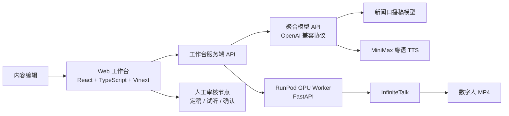
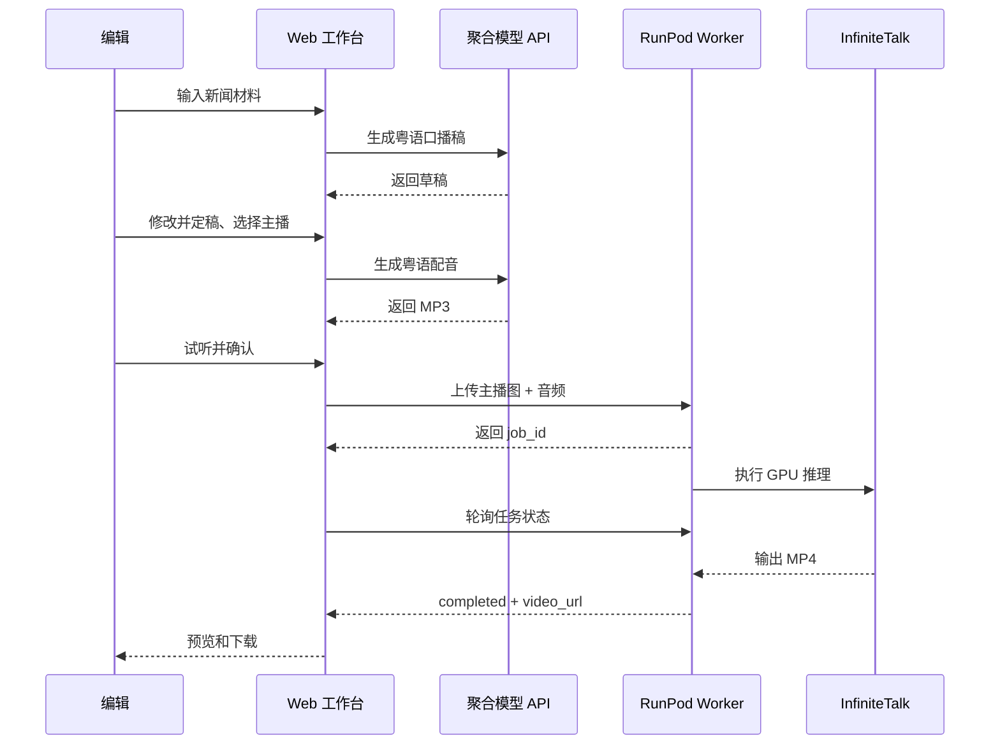

# 自动化新闻数字人系统基础技术文档

- 文档版本：V0.1
- 更新日期：2026-08-21
- 适用范围：新闻输入、粤语口播稿、配音、数字人对口型
- 暂不包含：素材匹配、B-roll、字幕包装、自动剪辑与发布

## 1. 项目目标

本系统是一个独立的内部 Web 工作台，目标是把 1–10 条新闻材料整理为约 4 分钟的香港粤语口播稿，经过人工审核后生成粤语配音，再将主播形象与音频交给数字人模型完成音画同步，最终输出可预览和下载的主播视频。

我们没有把系统做成不可干预的“一键黑盒”，而是将生产过程拆成多个可确认节点：

```text
新闻输入 → AI 生成口播稿 → 人工修改并定稿
→ 选择主播（同时绑定男女音色）→ 生成并确认配音
→ 提交数字人任务 → 轮询状态 → 预览/下载视频
```

人工确认是流程的一部分。未定稿的文本不能进入正式配音，未确认的音频不能进入数字人阶段。

## 2. 设计原则

1. **业务与模型解耦**：工作台只依赖统一的内部接口，文本、配音和数字人模型均可替换。
2. **服务端保管密钥**：浏览器不直接接触第三方 API Key 或远端 Worker Token。
3. **长任务异步化**：数字人渲染不阻塞 Web 请求，通过任务 ID 查询状态。
4. **版本绑定**：口播稿、音频、主播形象和数字人视频应绑定同一个稿件版本。
5. **先审核后生成**：新闻、文稿、音频均保留人工检查节点。
6. **算力隔离**：Web 工作台运行在普通服务器或本机，GPU 推理运行在 RunPod 等远端 GPU 环境。
7. **资产合规**：声音和人物形象只能使用已获得授权的资产。

## 3. 总体架构



系统目前由两类服务组成：

- **工作台服务**：负责界面、业务状态、模型适配、参数校验和远端任务代理。
- **GPU Worker**：负责接收主播图片和音频，调用 InfiniteTalk，保存任务状态与生成视频。

这样设计的主要原因是 InfiniteTalk 依赖大体积模型、CUDA 和高显存 GPU，不适合与 Web 工作台部署在同一台机器。

## 4. 当前技术栈

### 4.1 工作台

- React 19 + TypeScript
- Vinext / Vite
- 服务端 Route API
- Drizzle ORM 已加入依赖，数据库与正式任务持久化仍待接入
- 开发阶段使用本地静态资产和输出目录

### 4.2 模型聚合接口

工作台通过 OpenAI 兼容的聚合 API 访问模型，基础配置为：

```dotenv
OPENIAPI_BASE_URL=https://provider.example.com/v1
OPENIAPI_API_KEY=server-side-secret
LLM_MODEL=gpt-5.4
TTS_MODEL=speech-2.8-hd
```

`OPENIAPI_API_KEY` 只允许放在服务端环境变量中，不应提交到 Git，也不应返回给前端。

### 4.3 远端数字人服务

- RunPod GPU Pod
- Python 3.10
- FastAPI + Uvicorn
- PyTorch / CUDA
- InfiniteTalk
- Wan2.1 I2V 14B 480P 基础权重
- Chinese Wav2Vec2
- InfiniteTalk 单人模型与 FP8 量化权重

工作台通过 HTTPS 和 Bearer Token 调用远端 Worker。

## 5. 业务工作流

### 5.1 新闻输入

产品预留最多 10 条新闻链接。完整方案中，后台需要：

1. 校验 URL 和协议。
2. 防止 SSRF，禁止访问本机、内网和云元数据地址。
3. 抓取网页并提取标题、来源、发布时间和正文。
4. 对正文去广告、去导航、去重复。
5. 将读取失败的新闻单独标记，允许重试或人工粘贴正文。
6. 由编辑选择哪些来源参与成稿。

当前原型已能接收粘贴的新闻正文或事实摘要；自动抓取 1–10 条链接仍属于下一阶段。

### 5.2 口播稿生成

当前接口：

```http
POST /api/scripts/generate
Content-Type: application/json

{
  "sourceText": "整理后的新闻正文或事实摘要"
}
```

工作台调用聚合 API 的 `/chat/completions`。系统提示词要求模型：

- 仅使用传入材料，不补充外部事实。
- 使用自然、专业的香港粤语书面口语。
- 输出约 900–1100 个汉字，对应约 4 分钟播报。
- 包含简短开场、新闻之间的过渡和结尾。
- 不输出 Markdown、标题、注释或不可朗读标记。
- 对冲突或不完整信息使用审慎表达。

生成结果先进入可编辑区域。编辑修改并点击定稿后，后续配音应绑定该不可变稿件版本。当前原型已完成生成调用，正式的稿件版本表和定稿状态机仍待落库。

### 5.3 主播与音色绑定

系统设定两套香港青年主播资产：

| 主播 | 画面定位 | 默认音色 |
|---|---|---|
| 青年男主播 | 香港新闻主播、职业套装、正面播报 | `male-qn-qingse` |
| 青年女主播 | 香港新闻主播、职业套装、正面播报 | `female-shaonv` |

选择本期主播时，同时确定默认男女音色，避免出现男主播误配女声或相反的情况。后续可将主播资产扩展为包含：主播 ID、头像、正面竖图、三视图、默认音色、授权信息和可用状态的资产记录。

### 5.4 粤语配音

当前试听接口：

```http
POST /api/voice/test
Content-Type: application/json

{
  "text": "需要播报的粤语文本",
  "voiceId": "male-qn-qingse",
  "speed": 1.0
}
```

当前实现使用 MiniMax 的 `t2a_v2` 协议，默认模型为 `speech-2.8-hd`，并设置：

- `language_boost: Chinese,Yue`
- 32kHz、128kbps、单声道 MP3
- 语速限制为 0.8–1.2
- 服务端将供应商返回的十六进制音频解码为 MP3

`MiniMax-Voice-Clone` 用于创建或管理授权克隆音色；真正的长文本语音合成由 `speech-2.8-hd` 或 `speech-2.8-turbo` 完成。固定男女声后，业务侧应保存稳定的 `voice_id`，不在每期重复克隆。

正式版本需要补充：长稿分段、标点停顿、专有名词词典、分段失败重试、音频拼接和全文一致性校验。

### 5.5 数字人生成

配音确认后，工作台将主播图片与音频上传到内部接口：

```http
POST /api/avatar/jobs
Content-Type: multipart/form-data

image=<主播正面图>
audio=<确认后的配音>
anchor_id=<主播资产 ID>
```

工作台服务端不会直接运行模型，而是将文件转发给 RunPod Worker：

```http
POST {INFINITETALK_API_URL}/v1/jobs
Authorization: Bearer {INFINITETALK_API_TOKEN}
```

Worker 返回任务 ID，工作台随后轮询：

```http
GET /api/avatar/jobs/{job_id}
```

任务状态为：

```text
queued → running → completed
                 ↘ failed
```

成功后返回 `video_url`；失败时返回错误信息和推理日志末尾，便于诊断。

## 6. InfiniteTalk Worker 的实现

远端 Worker 位于 `gpu-worker/api.py`，主要职责如下：

1. 使用 Bearer Token 鉴权。
2. 校验图片和音频 MIME 类型。
3. 限制上传文件大小，默认单文件不超过 25MB。
4. 为任务生成 UUID，并保存输入文件和 `input.json`。
5. 使用单线程任务池执行 InfiniteTalk，避免同一 GPU 并发挤占显存。
6. 调用官方 `generate_infinitetalk.py`。
7. 将任务元数据持久化为 JSON。
8. 通过 `/outputs` 暴露生成的 MP4。
9. Worker 重启后，将中断的 `queued/running` 任务标记为失败，允许业务侧重试。

主要运行参数：

```text
size=infinitetalk-480
mode=streaming
motion_frame=9
num_persistent_param_in_dit=0
MAX_CONCURRENT_JOBS=1
```

### 6.1 FP8 方案

早期测试使用 RTX A6000 48GB 显存、约 50GB 容器内存。在加载 BF16 的 Wan2.1 14B 模型时，进程因系统内存不足被 OOM Killer 终止。为降低内存压力，我们补充了 InfiniteTalk 单人 FP8 权重，并在 Worker 中预留：

```dotenv
INFINITETALK_QUANT=fp8
INFINITETALK_QUANT_CKPT=/workspace/InfiniteTalk/weights/InfiniteTalk/quant_models/infinitetalk_single_fp8.safetensors
```

启动后，Worker 会向生成命令添加：

```text
--quant fp8 --quant_dir <FP8 权重路径>
```

更换 RunPod GPU 时不能只看显存，还要同时检查容器系统内存。对于 14B 模型，系统 RAM 不足同样会在模型加载阶段失败。

## 7. 接口与信任边界



信任边界如下：

- 浏览器只访问工作台 API，不读取供应商密钥。
- 工作台服务端可访问聚合模型 API 和 RunPod Worker。
- RunPod Worker 只接受带正确 Bearer Token 的任务查询与提交。
- 输出视频目前通过 Worker 静态路径访问；生产环境应改为有有效期的签名 URL 或对象存储。

## 8. 目录与文件职责

```text
app/
  page.tsx                         工作台界面与交互流程
  api/models/status/route.ts       聚合模型连通性检测
  api/scripts/generate/route.ts    粤语口播稿生成
  api/voice/test/route.ts          粤语配音试听
  api/avatar/jobs/route.ts         提交数字人任务
  api/avatar/jobs/[id]/route.ts    查询数字人任务
  lib/openiapi.ts                  聚合模型 Provider Adapter

public/anchors/                    主播图片资产
outputs/audio/                     本地测试音频
gpu-worker/api.py                  RunPod 异步推理 API
gpu-worker/Dockerfile              Worker 镜像基线
gpu-worker/requirements.txt        Worker Python 依赖
docs/PRD.md                        产品需求基线
```

## 9. 环境变量

工作台：

```dotenv
OPENIAPI_BASE_URL=
OPENIAPI_API_KEY=
LLM_MODEL=gpt-5.4
TTS_MODEL=speech-2.8-hd

INFINITETALK_API_URL=
INFINITETALK_API_TOKEN=
```

RunPod Worker：

```dotenv
INFINITETALK_API_TOKEN=
PUBLIC_BASE_URL=
INFINITETALK_ROOT=/workspace/InfiniteTalk
INFINITETALK_DATA=/workspace/infinitetalk-data
PYTHON_BIN=/root/envs/infinitetalk/bin/python
WAN_CKPT_DIR=/workspace/InfiniteTalk/weights/Wan2.1-I2V-14B-480P
WAV2VEC_DIR=/workspace/InfiniteTalk/weights/chinese-wav2vec2-base
INFINITETALK_CKPT=/workspace/InfiniteTalk/weights/InfiniteTalk/single/infinitetalk.safetensors
INFINITETALK_QUANT=fp8
INFINITETALK_QUANT_CKPT=/workspace/InfiniteTalk/weights/InfiniteTalk/quant_models/infinitetalk_single_fp8.safetensors
INFINITETALK_STEPS=20
MAX_CONCURRENT_JOBS=1
```

真实密钥不能写入 `.env.local.example`、文档、日志或 Git 历史。

## 10. 当前完成度

| 模块 | 当前状态 | 说明 |
|---|---|---|
| 工作台基础界面 | 已实现原型 | 已形成新闻、稿件、配音、数字人步骤 |
| 模型连通性检测 | 已实现并验证 | 可检测聚合 API 和目标模型 |
| 粤语口播稿生成 | 已接入 | 支持粘贴材料生成约 4 分钟稿件 |
| 固定男女音色 | 已接入原型 | 已限制为预设男声、女声 ID |
| 粤语试听 | 已实现并验证 | 可生成 MP3 |
| 主播选择 | 已实现原型 | 主播与默认音色需要进一步资产化 |
| 数字人任务 API | 已实现 | 工作台和远端 Worker 均有接口 |
| RunPod 部署 | 已完成基础部署 | 已下载基础权重和单人 FP8 权重 |
| InfiniteTalk 完整成片 | 联调中 | 需在新 GPU 配置上完成 FP8 全链路验证 |
| 新闻链接自动读取 | 未完成 | 当前以粘贴正文/摘要为主 |
| 数据库与版本状态机 | 未完成 | Drizzle 依赖已准备，尚未落库 |
| 素材匹配与剪辑包装 | 不在当前范围 | 后续阶段建设 |

## 11. 下一阶段实施顺序

1. 在当前 RunPod GPU 上以 FP8 启动 Worker，完成一条短粤语音频的真实视频测试。
2. 验证模型加载峰值 RAM、显存、首帧耗时、整体生成速度和成片质量。
3. 将测试成功的视频回传工作台，完成提交、轮询、预览和下载闭环。
4. 增加正式的 `Project`、`ScriptVersion`、`VoiceRender`、`AvatarRender` 和 `JobEvent` 数据表。
5. 实现稿件定稿、音频确认和版本绑定，禁止跨版本调用。
6. 实现 1–10 条新闻链接抓取、正文清洗、来源选择和事实追溯。
7. 实现长文本配音的可靠分段、重试、拼接和词典能力。
8. 将主播图片、默认音色和授权信息整理为可管理的主播资产。
9. 增加任务幂等、超时、重试、成本记录、日志脱敏和告警。

## 12. 验收一条完整链路的最低标准

一次端到端测试至少需要满足：

- 输入材料能生成符合长度要求的粤语口播稿。
- 人工修改后的定稿内容与生成音频一致。
- 选择男/女主播后使用对应固定音色。
- 音频可以试听并明确确认。
- 数字人任务异步提交成功，页面可查询状态。
- InfiniteTalk 输出可播放 MP4，口型与音频基本同步。
- 所有产物能追溯到本期主播和稿件版本。
- 失败时保留文稿和音频，只重试失败阶段。

这份文档描述的是当前原型的真实基础以及计划中的生产化边界，可作为后续开发、RunPod 联调和团队沟通的技术基线。
