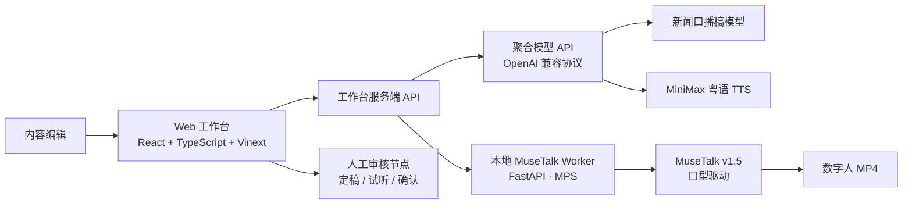

# 自动化新闻数字人系统 · 数字人阶段融合方案

- 文档版本：V0.2（融合版）
- 基础版本：V0.1（2026-08-21）
- 融合内容：用 **MuseTalk-mac（本地 MPS）** 替换原数字人阶段 **InfiniteTalk + Wan2.1 I2V 14B（RunPod 云端）**
- 变更原则：工作台、聚合模型 API、三段人工确认点（来源确认/文稿定稿/音频确认）全部保留不动，仅替换「模型层 + GPU Worker + 主播资产形态」

---

## 1. 融合结论

| 项 | 原方案（V0.1） | 融合后（V0.2） | 影响面 |
|---|---|---|---|
| 数字人模型 | InfiniteTalk Single（FP8 19.5GB） | MuseTalk v1.5（MPS，约 4GB 权重） | 模型层替换 |
| 基础视频模型 | Wan2.1 I2V 14B（图生视频） | 无需（使用主播底片视频） | 整段删除 |
| 算力位置 | RunPod 云端 GPU（按任务启停） | 本地 Mac（Apple M5 Pro，MPS） | 部署方式变化 |
| 主播素材 | 一张正面照片 | 一段 60s~3min 底片视频 | 资产准备变化 |
| 推理成本 | GPU 按时计费 | 仅电费（零边际成本） | 成本结构变化 |
| 接口契约 | POST /v1/jobs（image+audio） | POST /v1/jobs（video+audio） | Worker 内改造 |
| 工作台代码 | — | 零改动 | ✅ |
| 聚合 API / 确认点 | — | 零改动 | ✅ |

**核心权衡**：原方案「照片即可动」的灵活性 → 换成「先录底片、之后每日零成本量产」。对日更新闻播报场景，后者更划算。

---

## 2. 变更范围（最小化）

```text
保留不动：
  Web 工作台（React + TypeScript）
  工作台服务端 API（/api/scripts/generate、/api/voice/test、/api/avatar/jobs）
  聚合模型 API（LLM 口播稿 + MiniMax 粤语配音 speech-2.8-hd）
  三段人工确认点（A 来源确认 / B 文稿定稿 / C 音频确认）
  版本绑定原则（稿件/音频/主播/视频同一版本）

替换：
  模型层：InfiniteTalk + Wan2.1 I2V 14B → MuseTalk v1.5（MPS）+ Mediapipe
  Worker：gpu-worker（RunPod CUDA 环境）→ 本地 MuseTalk Worker（MPS 环境）
  主播资产：照片 → 底片视频（首次录制，之后复用）
```

---

## 3. 新架构



与原架构的唯一区别：`RunPod GPU Worker → 本地 MuseTalk Worker`。

---

## 4. Worker 改造（gpu-worker → musetalk-worker）

### 4.1 接口契约对齐

保持 Worker 外壳（Bearer Token 鉴权、异步任务、状态机、/outputs 静态暴露）不变，仅调整：

```http
POST /v1/jobs
Content-Type: multipart/form-data

video=<主播底片视频.mp4>        # 原 image=<主播正面图>
audio=<确认后的配音.mp3>        # 不变
anchor_id=<主播资产 ID>         # 不变
```

任务状态机不变：

```text
queued → running → completed
                 ↘ failed
```

### 4.2 run_job 内部调用替换

原实现（调用 InfiniteTalk 官方推理脚本）：

```text
generate_infinitetalk.py
  --cond_video <image>          # 实际是静态图
  --cond_audio <voice>
  --size infinitetalk-480
```

融合后（调用 MuseTalk-mac 推理）：

```text
MuseTalk inference
  video_path = <主播底片视频>      # 逐帧驱动
  audio_path = <确认音频>
  bbox_shift = <按主播脸型微调>
  输出 MP4（保留底片画面，仅替换嘴部）
```

实现要点：

1. 底片时长需 ≥ 音频时长（输出帧数 = 底片帧数）；不足时先用 ffmpeg 循环拼接底片：
   ```bash
   ffmpeg -stream_loop 2 -i base.mp4 -t 180 padded.mp4
   ```
2. 口型只改嘴部 → 底片要求「正脸、单人、镜头稳定、无遮挡」；避免快速转头、抬手挡脸。
3. 首次渲染前可调用 `/warmup` 预加载并缓存主播形象（avatar caching），重复生成更快。
4. 并发数保持 1（MAX_CONCURRENT_JOBS=1），避免 MPS 显存/内存竞争。

### 4.3 环境变量

```dotenv
# 本地 MuseTalk Worker
MUSETALK_API_TOKEN=replace-with-a-long-random-token
PUBLIC_BASE_URL=http://localhost:8000
MUSETALK_ROOT=/path/to/musetalk-mac
MUSETALK_DATA=/path/to/musetalk-data
MAX_CONCURRENT_JOBS=1
```

工作台侧仅需把 `INFINITETALK_API_URL` 指到本机地址：

```dotenv
INFINITETALK_API_URL=http://127.0.0.1:8000   # 原 RunPod 地址
INFINITETALK_API_TOKEN=<同一 Token>
```

（环境变量名可保留，避免改工作台代码。）

---

## 5. 主播资产要求（重要变化）

| 项 | 原方案 | 融合后 |
|---|---|---|
| 资产形态 | 正面照片（静态） | 底片视频（60s~3min） |
| 录制频率 | 一次照片 | 一次底片，之后每日复用 |
| 画面要求 | 正脸 | 正脸、单人、光照均匀、镜头稳定 |
| 时长要求 | 无 | ≥ 最长口播时长（约 4 分钟，可循环拼接） |
| 动作要求 | 无 | 头部动作幅度小、无遮挡（口型驱动只改嘴部） |

**推荐录制方式**：主播正对镜头、端坐、自然眨眼，念一段固定稿（或静坐），录 60~90 秒；需要 4 分钟成片时用 ffmpeg 循环拼接。之后每天只需换音频。

**资产合规不变**：主播形象与授权信息仍按资产记录管理（主播 ID、底片、默认音色、授权状态）。

---

## 6. 验收标准更新（V0.2）

在原 8 项验收标准中，替换数字人相关项：

- ~~InfiniteTalk 输出可播放 MP4，口型与音频基本同步~~
- **MuseTalk 输出可播放 MP4（720P 及以上），口型与音频基本同步**
- **同一主播底片可重复用于多期音频（复用验证）**
- **3 分钟音频在本地 M5 Pro 上单次生成时长 ≤ 10 分钟**
- 其余标准（稿件定稿一致性、音色绑定、异步任务、版本追溯、失败保留产物）不变

---

## 7. 风险与限制

| 风险 | 说明 | 缓解 |
|---|---|---|
| 第三方移植维护 | barnent1/musetalk-mac 为社区移植（非腾讯官方），遇 bug 需自行跟进 | 保留 gpu-worker 代码分支，可随时回退云端方案 |
| 素材形态变化 | 从「照片即可」变「需要底片视频」 | 首次录制成本一次性；之后每日零边际成本 |
| 动作漂移 | 底片若有大动作，嘴部区域可能漂移 | 录制约束 + bbox_shift 微调 |
| 单人并发 | MPS 本地推理不适合多任务并发 | 保持 MAX_CONCURRENT_JOBS=1，任务排队 |
| 商用许可 | MuseTalk 上游许可需确认商用边界 | 商用前核对许可；自用无碍 |
| 长视频内存 | 极长底片一次性载入内存 | 底片控制 4~5 分钟；480P/720P 即可 |

---

## 8. 落地步骤

1. 本地安装 MuseTalk-mac（Python 3.11 venv + 依赖 + 4GB 权重 + 冒烟测试）。
2. 录制/制作一位主播的底片视频（60~90 秒，正脸端坐），ffmpeg 预检时长与帧率。
3. 改造 gpu-worker/api.py：`image` 字段改为 `video`，`run_job` 内部调用换为 MuseTalk 推理。
4. 用 30 秒粤语音频做端到端冒烟（提交 → 轮询 → 预览）。
5. 验证 3~4 分钟粤语成片：时长、口型、速度（目标 ≤10 分钟出片）。
6. 工作台侧把 `INFINITETALK_API_URL` 切到本机，跑通完整链路。
7. 数据表落地（Project / ScriptVersion / VoiceRender / AvatarRender / JobEvent）与版本绑定。

---

## 9. 与原方案的兼容性

- 所有已实现/已验证模块（工作台、口播稿、粤语配音、数字人任务 API 外壳）不受影响。
- gpu-worker 保留为可选分支：若未来需要「照片即动」的轻量生成或高并发，可切回 RunPod 方案。
- 本融合版与 V0.1 共用同一份 PRD 基线。
